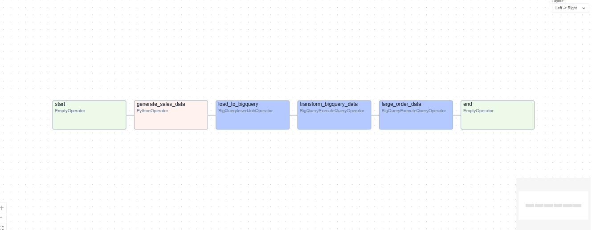

# Airflow-on-GCP-End-to-End-Data-Pipeline-with-Cloud-Composer-BigQuery-GCS


---

### **Repository Structure**

Here’s an example directory structure for your repository:

```
weather-api-sales-pipeline/
│
├── dags/
│   └── sales_orders_to_bigquery_with_transformation.py
│
├── requirements/
│   └── requirements.txt
│
├── assets/
│   └── diagrams.png          # Architecture diagram or visuals
│
├── README.md
├── LICENSE
├── .gitignore
└── CONTRIBUTING.md
```

---

### **Components to Include**


```markdown
# Airflow on GCP: End to End Data Pipeline with Cloud Composer, BigQuery & GCS

This repository contains an automated data pipeline built using **Apache Airflow**, **Google Cloud Storage (GCS)**, and **BigQuery**. The pipeline generates synthetic sales data, stores it in GCS, and processes it in BigQuery for downstream analysis.

---

## **Key Features**

- **Data Generation**: Generate synthetic sales data using the `Faker` library.
- **Data Storage**: Upload the data in CSV format to Google Cloud Storage.
- **BigQuery Loading**: Load raw sales data into BigQuery tables for storage and querying.
- **Data Transformation**: Add a meaningful column to categorize orders as `Small`, `Medium`, or `Large`.
- **Targeted Insights**: Extract and store large orders (`order_amount >= 500`) into a dedicated BigQuery table.

---

## **Business Impact**

1. **Efficiency**:
   - Automates data generation, ingestion, and transformation processes, saving hours of manual work.
2. **Scalability**:
   - Leveraging Google Cloud tools ensures the pipeline can handle large datasets as the business grows.
3. **Data Insights**:
   - Enables better decision-making by categorizing orders and highlighting high-value customers/orders.
4. **Flexibility**:
   - The modular design makes it easy to adapt for real-world use cases such as dynamic data streams from APIs.

---

## **Technology Stack**

- **Python**: Used for Airflow tasks and data generation.
- **Apache Airflow**: Workflow orchestration and automation.
- **Google Cloud Storage (GCS)**: Storage of raw data.
- **BigQuery**: Data warehouse for querying and transformations.
- **Faker**: Python library for synthetic data generation.

---

## **Project Pipeline**



1. Generate sales data and upload it to GCS.
2. Load raw sales data from GCS to BigQuery.
3. Transform the data in BigQuery (categorize orders).
4. Extract large orders (`order_amount >= 500`) into a separate table.

---

## **Setup Instructions**

### **Pre-requisites**
- A Google Cloud Platform (GCP) account.
- Cloud Composer environment set up.
- BigQuery dataset and tables created.

### **Steps**
1. Clone this repository:
   ```bash
   git clone https://github.com/your-username/weather-api-sales-pipeline.git
   cd weather-api-sales-pipeline
   ```

## Install required dependencies:
   ```bash
   pip install -r requirements/requirements.txt
   ```

## Upload the DAG to your Composer environment:
   - Place the `sales_orders_to_bigquery_with_transformation.py` file in the Composer bucket's `dags/` folder.

## Trigger the DAG from Airflow UI and monitor its execution.

---

## **BigQuery Schema**
### **sales_orders Table**
| Field Name      | Data Type   | Description                     |
|------------------|-------------|---------------------------------|
| `order_id`       | INTEGER     | Unique identifier for each order. |
| `customer_name`  | STRING      | Name of the customer.           |
| `order_amount`   | FLOAT       | Amount of the order.            |
| `order_date`     | DATE        | Date of the order.              |
| `product`        | STRING      | Product name.                   |

### **transformed_sales_orders Table**
| Field Name        | Data Type   | Description                          |
|--------------------|-------------|--------------------------------------|
| `order_category`   | STRING      | Categorizes the order as Small, Medium, or Large. |
| `load_timestamp`   | TIMESTAMP   | Timestamp when data was processed.  |

---

## **Contributions**
Contributions are welcome! Please see the [CONTRIBUTING.md](CONTRIBUTING.md) file for guidelines.

---

## **License**
This project is licensed under the MIT License - see the [LICENSE](LICENSE) file for details.


#### **3. `requirements.txt`**
List all dependencies required for the project, including versions:

```plaintext
Faker
pandas
google-cloud-storage
apache-airflow
```

---


---

### **Optional Enhancements**
- **Automated Tests**:
  - Write unit tests for the Python scripts.
- **CI/CD Integration**:
  - Use GitHub Actions to run tests on every commit.
- **Badges**:
  - Add status badges for build and test results.

---

